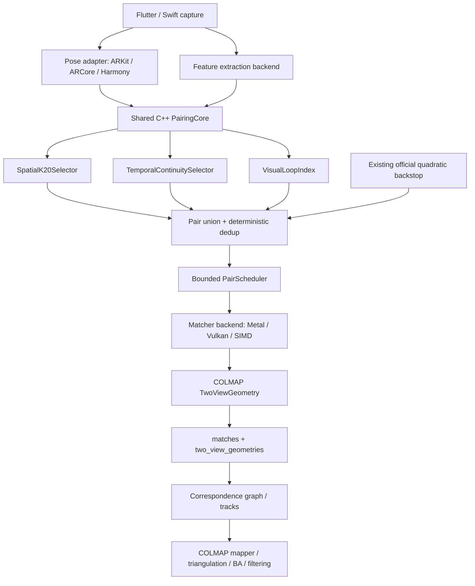

# PocketWorld 空间 K20 + 视觉回环 + 时间连续边完整执行提示词

> 从本标题以下内容可直接交给新的执行 Agent。
> 本文件是任务入口，不替代代码、OpenSpec、冻结输入、日志、哈希和物理 iPhone 证据。
> 代码、测试、有效配置和不可变 artifact 与本文件冲突时，以前者为准，并在继续之前修正文档。

---

## 你的角色与唯一目标

你接手的是 PocketWorld / Aether3D 生产 SfM 配对图重构与跨端提速。

唯一目标是把当前生产的纯时间 K12 改造成下列策略，并在不降低点云质量、不阻塞拍摄前端、不破坏本地产品功能的前提下压低真实 iPhone 的重建时间：

```text
空间 K20 为主
    + 视觉回环保险
    + 少量时间连续边
    -> 候选图片对并集与去重
    -> 现有 exact descriptor matcher
    -> COLMAP TwoViewGeometry 几何验证
    -> correspondence graph / tracks
    -> COLMAP mapper / triangulation / BA / filtering
```

用户已经明确裁决：空间关系必须成为主关系，不能再把纯时间 K12 当成产品终态。
该裁决来自真实多圈拍摄产生多层壳的产品事实，不是等待下一次实验才能决定的开放问题。
后续实验只验证实现是否正确、质量是否保持、速度是否达标，不再用一个偶然 fixture 推翻“空间优先”方向。

### 2026-08-03 用户终审补充（冲突时覆盖本文后续旧条款）

1. `S20 + T2` 是必须实现的跨端产品管线，不再运行 S12/S16/S20
   消融来表决空间序有没有必要；测试只允许防代码错误和为后续提速量账。
2. 执行顺序固定为：先完成共享 C++ 的空间序管线，再进行 feature
   budget、matcher、调度与流水提速。速度问题不得把产品恢复成时间主序。
3. `loop_cap37` 的所谓地板来自重力对齐后的低 Y 分位 RANSAC 自动拟合，
   没有人工地板标注，而且原报告的 PLY 对比明确仍“待用户肉眼”。因此地板下
   点数与缺失的 E20 公式只作历史诊断，不能自动否决 L4/P10。
4. 回环质量以匿名并排 PLY 的用户肉眼判断为主，优先检查地板上可见鬼壳、
   双层表面、物体错面和密度接缝。任何名为“地板”的数值门必须使用用户确认的
   fixture-specific 平面或 ROI；不得让自动低 Y 平面冒充语义地板。
5. 旧条款中 `BLOCKED_MISSING_LOOP_REQUALIFICATION_CONTRACT`、任何新增地板下点
   自动 FAIL、以及 K20 必须先由较小 K 获胜才能实施等表述，自本补充起失效。

---

## Authority order

按以下顺序解决冲突：

1. 用户本提示词中的明确产品要求。
2. 当前执行时的生产代码、测试、配置、二进制身份和物理 iPhone 日志。
3. 已接受的 OpenSpec 与不可变实验 artifact。
4. 本文件中的架构建议与预算假设。
5. 外部论文、官方文档、社区讨论和聊天记忆。

任何未经真机证实的收益都只能标为 `HYPOTHESIS` 或 `SCREENING`，不能进入生产预算 credit。

---

## 必须先读的本地材料

不要通读全部脏工作树。
先读取下列文件的相关章节和符号：

1. 当前总交接：
   `/Users/kaidongwang/Documents/progecttwo/CROSS_PLATFORM_SPEEDUP_CURRENT_EXECUTION_PROMPT_2026-08-03.md`
2. 生产配对、匹配、TVG、local mapping 主文件：
   `/Users/kaidongwang/Developer/Aether3D-cross/aether_cpp/official_pipeline/src/official_aether_sfm_c.cc`
3. 生产 C ABI：
   `/Users/kaidongwang/Developer/Aether3D-cross/aether_cpp/official_pipeline/include/official_sfm_c.h`
4. iOS 产品入口：
   `/Users/kaidongwang/Developer/pocketworld/ios/Runner/OfficialAetherARKitPlugin.swift`
5. vendored COLMAP 配对器：
   `/Users/kaidongwang/Developer/Aether3D-cross/aether_cpp/third_party/glomap_vendor/colmap-src/colmap/controllers/pairing.h`
   `/Users/kaidongwang/Developer/Aether3D-cross/aether_cpp/third_party/glomap_vendor/colmap-src/colmap/controllers/pairing.cc`
6. COLMAP 视觉索引：
   `/Users/kaidongwang/Developer/Aether3D-cross/aether_cpp/third_party/glomap_vendor/colmap-src/colmap/retrieval/visual_index.h`
7. 当前质量车道：
   `/Users/kaidongwang/Developer/Aether3D-cross/openspec/changes/portable-sfm-speedup-v1/quality-lane-budget-v1-draft.md`
8. tail-cache 证据：
   `/Users/kaidongwang/Documents/progecttwo/_host_experiments/tailcache-host-exact-20260802/REPORT.md`
   `/Users/kaidongwang/Documents/progecttwo/_host_experiments/tailcache-fault-injection-20260802/REPORT_V4.md`
9. 最新 201 帧真机结果：
   `/Users/kaidongwang/Documents/progecttwo/_artifacts/tailcache_phone_ab_20260803/on_unnamed3_201/ON_RESULT.md`

只读核对执行当下两个 Git 仓库的 HEAD、staged、unstaged 和 untracked 身份。
不得 reset、clean、checkout 覆盖或把旧 carrier 当当前产品母版。

---

## 当前生产事实

### 当前捕获期实际是纯时间模式

产品 Swift 入口当前存在：

```swift
setenv("OFFICIAL_AETHER_STREAM_TEMPORAL_ONLY", "1", 1)
```

因此 `SelectStreamCandidates` 虽然已经实现 ARKit 相机中心 KNN 和 45°视向门，实际生产仍被强制退回纯时间候选。
最新 201 帧日志中的 `spatial-first=0` 与全部 `temporal-fallback` 和该入口一致。

### 当前已经使用 COLMAP official quadratic overlap

`AddOfficialQuadraticPairs` 复刻 COLMAP `SequentialPairGenerator` 的 quadratic overlap 子集：

```text
时间间隔 1, 2, 4, 8, 16, 32, 64, 128, 256, 512
```

它是官方时间配对算法，但不是空间配对，也不是视觉回环。
它可能偶然击中跨圈重访，也可能因为真实重访间隔不是 2 的幂而完全错过。

### 当前没有真正执行官方视觉回环或官方空间配对器

vendored COLMAP 中存在：

- `SequentialPairGenerator`，支持可选 vocabulary-tree loop detection；
- `SpatialPairGenerator`，根据相机位置先验找空间近邻；
- `VocabTreePairGenerator` / `retrieval::VisualIndex`，根据视觉内容检索候选图片；
- `TransitivePairGenerator`，根据已有图关系补传递候选。

当前生产 wrapper 没有调用上述完整控制器。
自研 `AddSpatialRevisitMatches` 也被 `kProductionOfficialEndpointOnly` 直接 early-return。

### 当前空间优先代码已经存在，不能从零重写

`SelectStreamCandidates` 已经具备：

1. ARKit camera-center 距离排序；
2. 视向夹角小于 45°门；
3. 缺少 pose 时回退时间序；
4. frame ID 稳定 tie-break；
5. 与原 K 窗口相同的匹配和 TVG 写入路径。

新的工作应该把它提取成独立、可测试、跨端的 C++ PairingCore，并修正策略；不要在 9000 行主文件里再复制一份相似算法。

### 当前性能基线

最新 201 帧 ON 运行的诊断口径：

| 指标 | 当前观测 |
|---|---:|
| whole-frame final-third p50 | 约 2.996 s/帧 |
| 目标 | 不高于 1.642 s/帧 |
| 最新缺口 | 约 1.354 s/帧 |
| extract final-third p50 | 约 1.163 s/帧 |
| match + mapping final-third p50 | 约 1.765 s/帧 |
| GPU matcher final-third p50 | 约 1.070 s/帧 |
| TVG final-third p50 | 约 155 ms/帧 |
| Local BA final-third p50 | 约 354 ms/帧 |
| tail final-third p50 | 约 134 ms/帧 |
| capture stop -> PLY | 约 479.5 s |
| thermal serious | 27 个资源样本 |

上述阶段字段可能存在重叠，不能把各项机械相加成总时间。
实现者必须以同一帧互斥区间或明确包含关系重新核账。

### 当前特征规模

生产 GPU Stage-B 已观察到：

| 指标 | 值 |
|---|---:|
| preclamp median | 14,321 |
| preclamp p90 | 19,531 |
| preclamp max | 21,782 |
| legacy descriptor rows median | 9,280 |
| 31 帧中 legacy >8192 | 29 帧 |

严格或 coverage-8192 会改变特征集合，尚未通过质量终审。
它是可能的大刀，不是已获生产 credit 的 exact 优化。

### 用户已观察到空间优先质量方向更好

既有两个 fixture 的方向一致，其中一组指标：

| 指标 | 时间基线 | 空间优先 |
|---|---:|---:|
| RU 高残差占比 | 70.4% | 66.8% |
| 壳厚 p50 | 3.088 mm | 2.928 mm |
| 自由空间违规率 | 13.96% | 12.58% |

这些结果不能证明所有场景的精确收益幅度，但已经与用户多圈实拍的多层壳故障形成一致证据。
空间优先是产品要求；质量车道负责防止实现退化，不负责重新投票决定是否继续纯时间。

---

## 术语必须准确

### Camera trajectory

用户连续绕物体三圈，是一条连续相机运动轨迹，其中包含三个闭环。

### Feature track

物体同一个物理表面点在多张图片中的二维关键点观测集合。
如果该点每圈被五张照片看到，理想结果是十五个二维观测形成一条 feature track，最后对应一个三维点。

如果三圈之间没有跨圈图片边，系统可能建立三条彼此独立的 feature track，最后形成三个位置接近但不重合的三维点，表现为多层壳。

### Pair candidate is not a match

空间、时间和视觉检索只负责决定“哪些图片值得比较”。
它们不能直接宣布两个关键点是同一物理点。
真正的数据关联仍必须经过 descriptor matching、mutual/cross-check、ratio/absolute gate、COLMAP TwoViewGeometry RANSAC、三角化、正深度、重投影和 BA/filtering。

### Visual loop detection is not spatial KNN

空间 KNN 依赖相机 pose。
视觉回环依赖画面内容。
ARKit 漂移、pose 缺失或同位置不同朝向时，两者会产生不同候选，因此必须互补。

---

## 外部证据账

### COLMAP 官方

COLMAP 官方教程明确把匹配拆成多种可组合模式：Exhaustive、Sequential、Vocabulary Tree、Spatial、Transitive 和 Custom。
同一个数据库可以先后运行多种 matcher；已存在图片对会低成本跳过，因此官方设计本身支持“候选集合并集”，而不是强迫用户在时间序和空间序之间二选一。

来源：

- https://colmap.github.io/tutorial.html
- https://colmap.github.io/cli.html

COLMAP `SequentialPairingOptions` 的关键默认：

- `overlap = 10`；
- `quadratic_overlap = true`；
- `loop_detection = false`；
- loop detection period = 10；
- loop retrieve images = 50。

“内置 loop detection”代表有该能力，不代表默认自动开启。

COLMAP `SpatialPairingOptions` 支持 `max_num_neighbors`、`min_num_neighbors`、`max_distance` 和 `ignore_z`。
官方实现使用 position prior 的欧氏 KNN；它本身不使用相机朝向。
PocketWorld 已有的 45°视向门属于适合物体扫描的产品改进，不得冒充上游原样行为。

COLMAP vocabulary-tree 视觉索引基于：

- Schönberger et al., “A Vote-and-Verify Strategy for Fast Spatial Verification in Image Retrieval”, ACCV 2016。
- https://colmap.github.io/

### RealityScan / RealityCapture

RealityScan 没有公开其闭源候选配对实现，也没有公开说自己使用“时间 K”或“空间 K”。
官方材料能够确认：

- alignment 通过图像特征和共同 tie points 建立稀疏点云；
- camera pose prior 可以是 unknown、approximate、exact 或 locked；
-公开参数包含 image overlap、preselector features、reprojection error 和 pose prior 权重；
- Mobile 拍摄指南建议绕物体分层走圈并保持约 70% 全方向重叠。

来源：

- https://rshelp.capturingreality.com/en-US/tutorials/quickstart_2.htm
- https://rshelp.capturingreality.com/en-US/appbasics/camerasettings_priors.htm
- https://dev.epicgames.com/documentation/realityscan/keys-and-values
- https://dev.epicgames.com/documentation/realityscan-mobile/Photogrammetry-Camera-Movement

2016 年官方论坛人员曾表示文件名顺序不重要、图片按图像关系检查。
该答复只能支持“不是明显依赖文件时间顺序”，不能证明 2026 年实现仍是全量两两匹配。

- https://forums.unrealengine.com/t/photo-order/708384

### SLAM 与层次检索理论

ORB-SLAM 系列将短期跟踪、共视图 local map 和独立 place recognition / loop closing 分成不同职责。
核心启发是：时间相邻适合短期连续性；共视关系和 place recognition 负责相隔很远的重访。

- ORB-SLAM, IEEE Transactions on Robotics: https://doi.org/10.1109/TRO.2015.2463671
- ORB-SLAM3: https://arxiv.org/abs/2007.11898

Hierarchical Localization 将粗粒度图像检索与细粒度 local feature matching 分层，说明先以低成本 retrieval 缩小候选，再做昂贵精确匹配，是兼顾可扩展性和准确性的通用结构。

- Sarlin et al., “From Coarse to Fine: Robust Hierarchical Localization at Large Scale”, CVPR 2019: https://openaccess.thecvf.com/content_CVPR_2019/papers/Sarlin_From_Coarse_to_Fine_Robust_Hierarchical_Localization_at_Large_Scale_CVPR_2019_paper.pdf
- hloc: https://github.com/cvg/Hierarchical-Localization

### 许可证边界

ORB-SLAM3 是 GPL-3.0。
可以研究其论文思想，禁止复制其 GPL 源码进入商业生产代码。
DBoW2、第三方词汇树文件、训练数据和任何新的视觉模型都必须分别做代码、依赖、模型/数据、notice 和商业使用审计。
现有 vendored COLMAP 视觉索引头文件是 BSD-style notice，但仍必须冻结实际 revision 和所用 vocabulary-tree asset 的来源及哈希。

---

## 三种方案与最终选择

### 方案 A：完整官方组合

使用 COLMAP `SpatialPairGenerator(max_num_neighbors=20)`、`SequentialPairGenerator`、开启官方 vocabulary-tree loop detection，并把多种配对结果写入同一数据库。

优点：官方参考意义最强，最容易回答“COLMAP 原版会怎么做”。

缺点：官方 Spatial 只看位置，不看相机朝向；官方 loop 默认可一次检索很多图片；离线控制器不直接适合实时 ARKit 队列；如果原样照搬，手机 pair 数和热负荷可能过大。

定位：必须建立为 `COLMAP_FULL_PAIRING_REFERENCE`，用于语义和质量参考，不直接假定为产品最快终态。

### 方案 B：只启用现有自研空间 KNN

删除 temporal-only 强制开关，把现有 `SelectStreamCandidates` 的 K 从 12 改成 20。

优点：改动最小，已有质量方向证据，最快能形成 vertical slice。

缺点：现有策略最多 K 个总候选，时间边只是空间集合不足时的 fill；没有独立视觉回环；ARKit 漂移或 pose 缺失时会退化；所有逻辑仍埋在巨型生产 TU 中。

定位：只可作为第一阶段单变量验证，不是完整终态。

### 方案 C：共享 C++ 三源候选图

采用以下固定职责：

1. `S20`：20 个非近期空间候选，负责跨圈、回访和空间覆盖；
2. `T2`：前 1、2 帧连续边，负责快速运动和 pose 暂时不可靠时不断链；
3. `L4/P10`：每 10 帧执行一次视觉检索，最多补 4 个尚未覆盖的远期候选；
4. 三者并集、去重、统一匹配和几何验证；
5. 第一版原样保留当前 official quadratic 收尾安全网，避免在同一轮改变四个变量；新图质量通过后，再用独立单变量实验决定是否关闭或降为 fail-safe debt。

这是推荐并由本提示词采用的终态设计。
它实现用户指定的“空间 K20 为主 + 视觉回环保险 + 少量时间连续边”，也允许把共享算法放到 C++ 并保留 Metal/Vulkan 平台热核。

但 `K20` 是质量图目标，不是可以单独上线的提速臂。当前从约12对增加到约22.4对，匹配负荷会先增加约87%。生产默认启用必须满足下面的硬依赖，而不能只凭质量改善上线：

```text
K20_PRODUCTION_DEFAULT_ALLOWED =
  K20质量门PASS
  AND (
    coverage-8192质量门PASS
    OR 实测每对等效成本下降足以抵消pair增幅
  )
  AND 物理iPhone端到端速度/热/稳定性门全部PASS
```

按当前22.4/12的估算，第二个分支至少要求候选每对等效成本不高于control的 `12/22.4 ≈ 0.536`，即下降不低于约46.4%；这个比例必须用真机实测pair数重算。`coverage-8192 PASS` 只解锁组合实验，不自动证明组合速度合格。

---

## High-level architecture



### 跨端边界

共享 C++ 必须拥有：

- pose 与 frame 的平台无关数据结构；
- S20/T2/视觉回环候选策略；
- pair union、来源标签、稳定排序和去重；
- scheduler 优先级、backpressure 和 debt 状态；
- telemetry schema；
- matcher backend contract；
- host golden 和跨端确定性测试。

平台适配层只负责：

- 把 ARKit、ARCore 或鸿蒙 AR pose 转成统一坐标和四元数；
- 提供灰度图、intrinsics、时间戳、追踪状态和 thermal 状态；
- 调用 C ABI；
- iOS 绑定 Metal，Android/鸿蒙绑定 Vulkan，CPU SIMD 为保底。

Dart / Flutter 不得承载 KNN、视觉词袋、descriptor 热计算或匹配图规则。

---

## PairPolicyV2 精确定义

### 初始冻结参数

第一版使用以下参数，所有后续改动必须作为新实验单变量：

| 参数 | 初始值 | 含义 |
|---|---:|---|
| `spatial_k` | 20 | 每个新帧最多20个空间候选 |
| `temporal_edge_count` | 2 | 强制保留前1、2帧 |
| `spatial_recent_exclusion` | 2 | S20不重复选择已经由T2负责的两帧 |
| `view_angle_max_deg` | 45° | 沿用已验证方向的同向视域门 |
| `loop_period` | 10 | 每10帧查询一次视觉回环 |
| `loop_retrieve_count` | 50 | 粗检索最多返回50张图，沿用COLMAP默认量级作为参考 |
| `loop_accept_cap` | 4 | 每次查询最多加入4个新远期图片对 |
| `loop_temporal_exclusion` | 20 | 视觉回环不检索最近20帧 |
| `max_new_pairs_normal_frame` | 22 | 非loop帧上限：S20+T2 |
| `max_new_pairs_loop_frame` | 26 | loop帧上限：S20+T2+L4 |

这些数值是工程起点，不是收益结论。
用户裁决的是空间 K20 主导结构；T2、P10、L4可在保持该结构的前提下经过独立实验调整。

`spatial_k=20` 也必须做边际价值消融，而不能成为另一个未经检验的固定预算。质量车道在相同冻结输入、相同T2/L4、相同feature budget和相同下游配置下运行 `S12`、`S16`、`S20` 三臂，报告第13–16和第17–20条空间边分别贡献的有效TVG、跨圈track、注册帧、壳厚和自由空间改善。这个K-sweep只解释边际价值；未经用户新的明确裁决，不得因为较小K更快就静默把既定空间K20产品目标降成K12或K16。

### S20 空间选择

输入：当前帧 pose、历史有效 frame pose、descriptor 可用性和 frame ID。

规则：

1. 排除当前帧和最近两帧；最近两帧由 T2 独立负责。
2. 排除没有可用 descriptor 的历史帧。
3. 只把 pose 有效的历史帧放入空间池。
4. 计算 camera-center 欧氏距离平方。
5. 计算当前与历史相机 forward-axis 的点积。
6. 视向夹角超过45°则拒绝，防止同位置反向拍摄被误认为共视。
7. 按 `(distance_squared, frame_id)` 升序稳定排序。
8. 取前20个。
9. 最终输出按 frame ID 升序，保持后续 DB 写入和匹配顺序确定。

第一版复用现有 `SelectStreamCandidates` 的坐标转换和 45°门，避免引入额外几何模型。
“按物体中心估计重叠”“位姿网格多样性”“共视图重排”都作为后续独立候选，不能塞入第一版造成多变量。

### T2 时间连续边

无论 S20是否已经充足，都尝试加入 `frame_id-1` 和 `frame_id-2`。
如果图片对已经存在，只做去重，不重算。

T2职责只有：

- 突然移动时维持短期连续性；
- 当前帧 pose 无效时至少提供短期连接；
- 给实时预览和早期初始化提供低延迟边。

禁止重新把 T2 扩成时间 K12并挤掉 S20。

### L4/P10 视觉回环

每10个有效帧触发一次视觉检索。

第一候选实现优先复用 vendored COLMAP `retrieval::VisualIndex` 与当前 SIFT descriptor，不引入新的神经模型。
原因：当前生产已经计算 SIFT/RootSIFT descriptor；复用它能减少模型下载、跨端推理和新语义变量。

流程：

1. 每帧把用于 retrieval 的 descriptor 子集加入视觉索引。
2. 索引特征上限必须单独冻结；默认从现有 descriptor 中按尺度/稳定键取固定上限，不能随机抽样。
3. 每10帧查询一次最多50个视觉相似图片。
4. 排除最近20帧、S20/T2已选图片和数据库已有图片对。
5. 先按 retrieval score 排序，再按 frame ID 完整 tie-break。
6. 最多取4个新候选进入统一 matcher。
7. descriptor match 和 TwoViewGeometry 未通过的候选不得写入有效图边。
8. 视觉索引缺失、asset损坏、内存不足或初始化失败时，fail closed 到 S20+T2；不能阻塞拍摄或改用未经注册的新模型。

视觉回环只负责候选召回，不直接执行 pose graph 矫正。
现阶段继续由 COLMAP mapper、全局 BA和已有几何路径处理一致性。
如果未来增加显式 Sim3 loop correction，必须另开 OpenSpec，不能偷渡到本任务。

### 07-28 回环 DO-NOT-SHIP 判决的强制继承

本任务不是第一次尝试回环。2026-07-28 的历史终审已经证明：当时的回环机制在位姿选取验证上可用，但候选产生鬼壳/双层地板，约12.5%的样本触发E20硬门，并且在146–156帧区间没有证明付出的额外匹配成本产生了价值，因此结论是 `DO_NOT_SHIP`。

201帧真实采集的出现只满足了“可以重新打开调查”的前提，不撤销旧判决。任何 `L4/P10` 臂从shadow晋级质量候选之前，必须把07-28判决的耐久artifact路径、SHA和当时E20精确定义写入新实验合同；如果找不到原始artifact或E20公式，返回 `BLOCKED_MISSING_LOOP_REQUALIFICATION_CONTRACT`，禁止凭聊天记忆重写门槛。

复活合同至少包含：

1. 在冻结的真实201帧或更长多圈输入上重跑回环harness，不得再以146帧以内的小窗口替代。
2. 按历史论文/设计 §7.5.1 重测 CAUCHY robust kernel；参数、control、seed、排除规则和接受门必须在看结果前冻结，禁止事后换核救结果。
3. 对所有跨圈loop pair做鬼壳/双层地板法医：记录pair、TVG inlier、track合并、壳厚p50/p90、自由空间违规和最终PLY可视化；任何新增鬼壳或双层地板直接FAIL。
4. 恢复并执行E20触发率硬门。历史约12.5%结果属于已知FAIL，不得放宽原门；候选必须同时满足历史E20门和本提示词更严格的误回环/壳厚门。
5. 逐帧给出146–156帧以及final-third新增loop边的边际收益，证明额外边确实改善注册、跨圈track或几何，而不只是增加匹配数。

在上述五项全部通过以前，视觉回环只允许 `OFF`、shadow或冻结输入质量实验，不能成为生产默认，也不能借“官方有loop detection”绕过历史否决。

### Pair union 与来源

每个候选图片对使用 canonical key：

```text
(min(image_id_a, image_id_b), max(image_id_a, image_id_b))
```

一个 pair 可以同时拥有多种来源标签：

```text
SPATIAL_K20
TEMPORAL_CONTINUITY
VISUAL_LOOP
QUADRATIC_FAILSAFE
OFFICIAL_REFERENCE
```

来源标签用 bitset 表示，去重不能丢失来源。
调试输出必须记录 union 前后数量、重复来源和最终 ordered pair digest。

### 优先级

默认调度优先级：

1. T2：优先保证新帧短期可注册和预览连续。
2. S20：主要质量图，紧随T2进入后台队列。
3. L4：保险边，可稍后执行，但必须在最终 mapper/BA前持久化。
4. 第一版继续执行当前 official quadratic 收尾安全网，并跳过已经存在的 pair。

S20/T2/L4质量通过后，另开 `QUADRATIC_BACKSTOP_V2` 单变量：control保留当前quadratic，candidate关闭无条件quadratic或只在图健康不足时补债。
图健康门必须在看结果前冻结，至少覆盖最大连通分量、跨圈有效边、注册帧、track>=3和final-third帧连接；没有冻结门不得实现动态触发。

优先级只影响执行时刻，不得改变最终被接受的 pair 集合和写入顺序合同。

---

## VisualLoopIndex 实现约束

### 首选路径

先做 `COLMAP_VOCAB_REFERENCE`：用实际 vendored `VocabTreePairGenerator` / `VisualIndex` 在冻结输入上产生官方候选序列和 digest。

再做 `PORTABLE_VISUAL_LOOP_V1`：在共享 C++ 中包装同一视觉索引语义，并通过明确的 C ABI 接入流式生产。

不得只复制几行逻辑后声称“官方 loop detection 已复刻”。
必须比较：

- 输入 descriptor 集和顺序；
- vocabulary-tree asset SHA-256；
- index/query参数；
- query frame IDs；
- retrieval候选有序序列；
- score和tie-break；
-最终进入matcher的pair digest。

### Asset与商业边界

生产 App 不得在第一次拍摄时从网络自动下载词汇树。
词汇树必须：

1. 固定来源、版本、SHA-256和大小；
2. 通过商业使用和notice审计；
3. 作为签名资源或版本化数据随App分发；
4. 缺失时清晰降级，不闪退；
5. 不允许另一个Agent用不同asset静默替换。

### 性能边界

视觉检索运行在 CPU 后台线程或独立低优先级队列，不能抢占 Metal matcher 和相机 GPU。
如果 COLMAP VisualIndex 在 A16 的 CPU、内存或包体上过门失败，才开启第二候选：自研轻量 SIFT BoW/inverted index。
第二候选仍必须遵守相同 retrieval contract、license audit和物理 iPhone质量门。

禁止未经证明直接上 NetVLAD、DINOv2、XFeat 或其他神经网络回环模型。
这些模型可能有召回优势，但会新增模型许可、包体、跨端runtime、thermal和质量变量。

---

## Shared C++ interface direction

不要把下面的草图逐字照抄；先沿用仓库命名和 ABI 兼容规则。
接口必须表达等价职责：

```cpp
enum class PairSource : uint32_t;

struct PortableFramePose {
  int32_t frame_id;
  double center_xyz[3];
  double forward_xyz[3];
  bool pose_valid;
  int32_t tracking_state;
};

struct PairCandidate {
  int32_t image_a;
  int32_t image_b;
  uint32_t sources;
  double spatial_distance_m;
  double view_angle_rad;
  float retrieval_score;
};

struct PairPolicyConfig {
  int32_t spatial_k;
  int32_t temporal_edge_count;
  int32_t loop_period;
  int32_t loop_retrieve_count;
  int32_t loop_accept_cap;
};
```

需要的新模块建议：

```text
aether_cpp/official_pipeline/src/pair_selection_v2.h
aether_cpp/official_pipeline/src/pair_selection_v2.cc
aether_cpp/official_pipeline/src/visual_loop_index_v1.h
aether_cpp/official_pipeline/src/visual_loop_index_v1.cc
aether_cpp/official_pipeline/src/pair_scheduler_v1.h
aether_cpp/official_pipeline/src/pair_scheduler_v1.cc
aether_cpp/tests/sfm/test_pair_selection_v2.cpp
aether_cpp/tests/sfm/test_visual_loop_index_v1.cpp
aether_cpp/tests/sfm/test_pair_policy_integration_v1.cpp
```

`official_aether_sfm_c.cc` 只保留组装和对现有 matcher/TVG/DB 的调用。
不要借本任务重构提取器、BA、编辑页、压缩、相册或 Flutter UI。

C ABI 需要显式版本或 size 字段，保证旧 Swift/Dart 调用者不会因结构体尾部扩展而错位。
不得把生产接受状态依赖于一次进程 `setenv`。

实验阶段可以使用env强制arm；候选接受后应由版本化 C ABI 配置和持久默认策略决定：

```text
PAIR_POLICY_TEMPORAL_REFERENCE
PAIR_POLICY_SPATIAL_K20_V1
PAIR_POLICY_SPATIAL_K20_LOOP_V1
```

保留持久化紧急关闭开关，但默认策略必须能从桌面图标重启后继续成立。

---

## Scheduler 与前端流畅性

用户要求快门在一次点击后的下一次UI刷新即可继续使用。
后端可以排队，但前端不能因匹配或回环而等待。

因此：

1. capture callback只复制/持有必要输入和提交任务，不同步等待S20、视觉检索或GPU matcher。
2. 原始高分辨率照片继续落盘并保留；不能为了队列轻量化丢掉原图。
3. 队列必须有明确所有权和有界元数据；图像字节使用落盘引用或受控缓存，不能无上限复制。
4. T2/S20/L4任务进入同一有序后台scheduler。
5. 捕获与重建开始时，后台压缩暂停；任务结束后续跑。
6. tail-cache/dirty-epoch保持启用候选，不得被新pair写入绕过；每种新pair写入都要正确mark dirty或增量更新。
7. 300帧门要求不闪退、不长期灰快门、队列能完整drain、内存不持续线性增长。

禁止用丢帧、跳过用户照片、降低特征、减少BA或延迟到用户永远等不到的后台来伪造前端流畅。

---

## 计算预算与关键矛盾

当前近似：

```text
GPU matcher final-third ≈ 1068 ms/帧
≈ 12 pairs/frame × 89 ms/pair
```

如果直接从12个完整匹配对增加到平均约22.4个：

```text
20 spatial + 2 temporal + 4/10 loop average = 22.4 live pairs/frame
22.4 / 12 ≈ 1.87×
```

当前finalize quadratic会额外尝试稀疏长距pair，但会跳过已存在pair；它的剩余绝对成本必须单独记录，不能藏在22.4的live预算里。

在每对成本不变时，GPU matcher理论上会从约1.07秒上升到约2.0秒。
因此“只把K改20”不能被宣传为提速，它首先是质量图修复。

feature-budget的理论联动：

```text
(8192 / 14321)^2 ≈ 0.327
0.327 × (22.4 / 12) ≈ 0.611
```

若 coverage-8192 通过质量门，且每对核心成本近似按 descriptor 矩阵面积缩放，新的候选图GPU匹配成本可能约为当前的61%，即从约1068ms降到约650ms。
这只是预算假设，不是生产credit。
实际还会受到legacy descriptor rows、mutual、TVG、映射、热状态、缓存和重复候选影响。

由此得到不可违反的执行纪律：

1. 先把S20/T2/L4质量图做正确；
2. 单独测量pair数量和每对成本，禁止把pair图和feature budget混成一个无法归因的首轮；
3. coverage-8192走自己的质量车道；
4. 两者分别通过后才做组合臂；
5. 如果coverage-8192失败，必须从track reuse、descriptor residency、exact kernel或更低成本retrieval继续找钱，不能偷偷降低质量门。
6. `S20_T2`或`S20_T2_L4`单独质量通过，也只能留在quality branch；在coverage-8192质量PASS或真机实测每对成本下降至少抵消pair增幅以前，禁止进入生产默认。
7. 以当前估算为例，22.4对对12对要求每对等效成本下降至少约46.4%；正式门必须用候选真机的实际去重后pair/frame、quadratic剩余成本和final-third thermal数据重算。

---

## Official reference lane

为了结束“用了official名字但没有完整官方pairing”的混乱，必须建立一条冻结参考线：

```text
COLMAP_FULL_PAIRING_REFERENCE_V1
```

它在同一冻结输入上执行：

1. 官方 `SpatialPairGenerator(max_num_neighbors=20)`；
2. 官方 `SequentialPairGenerator` quadratic overlap；
3. 官方 sequential loop detection，使用冻结vocab tree；
4. 相同 descriptor、matcher阈值、TwoViewGeometry和DB schema；
5. 官方 mapper/triangulation/BA/filtering。

参考线的作用：

- 说明上游完整组合的pair图和质量；
- 验证我们对官方语义的理解；
- 给产品改进路线提供对照。

它不自动成为生产赢家。
产品路线有两项明确、诚实标注的差异：

1. 使用ARKit物体扫描坐标和45°视向门；
2. 对视觉回环设置手机可承受的top-up cap。

只要存在这些差异，产品路线必须称为 `SPATIAL_K20_PRODUCT`，不能称“100%原样COLMAP”。

---

## OpenSpec 工作

新建独立 change：

```text
openspec/changes/spatial-k20-visual-loop-v1/
```

至少包含：

```text
proposal.md
design.md
tasks.md
experiment-contract.md
specs/pair-policy-v2/spec.md
specs/visual-loop-index-v1/spec.md
specs/cross-platform-pairing-core/spec.md
specs/phone-quality-speed-gates/spec.md
evidence/
```

不要把该大改继续堆进已经很庞大的 `portable-sfm-speedup-v1` 主正文。
新change引用现有quality lane、tail-cache、matcher exact和P3 runbook，不复制其全文。

OpenSpec必须明写：

- 空间K20是用户已裁决的产品要求；
- T2与L4/P10是实现参数；
- pair图改变属于质量语义变化，不是byte-exact优化；
- official reference与product lane分开；
- host只做候选与机制验证；
-物理iPhone全生产管线才有速度/质量接受权；
-任何生产App更新必须保留本地最新版全部产品功能和用户数据。

运行仓库现有的 strict OpenSpec validation，并把确切命令和结果写进 evidence。

---

## 分阶段实施计划

### Phase 0: 冻结合同与当前行为

目标：一天内不要再扩张仪器，只冻结实现所需最小事实。

动作：

1. 只读冻结产品仓、算法仓HEAD与完整dirty manifest。
2. 记录当前Swift入口的temporal-only强制开关。
3. 从最新201帧日志冻结当前ordered candidate pair digest、来源计数、pair/frame、GPU matcher、TVG、Local BA、thermal和queue数据。
4. 冻结三圈、单圈、折返和低纹理测试输入的manifest/hash；没有三圈原始输入时，先用已有用户项目做只读身份核对，不要求用户重复证明多层壳方向。
5. 写OpenSpec和单变量实验合同。

退出条件：当前生产pair policy能够被代码、配置和日志三方一致描述。

### Phase 1: 提取并测试现有空间selector

目标：先把已有空间逻辑从巨型TU拆出，不改变算法结果。

动作：

1. characterization测试冻结当前`SelectStreamCandidates`输出。
2. 提取为`pair_selection_v2`模块。
3. 旧K12 spatial模式在冻结输入上的ordered candidate IDs和digest必须逐位相同。
4. 保持45°门、无pose回退和稳定tie-break。
5. 主TU只调用新模块。

退出条件：重构前后selector输出exact；生产默认仍OFF，不碰手机。

### Phase 2: 实现S20 + T2

目标：把空间K20与时间连续边从“填充关系”改成两个独立来源。

动作：

1. S20排除最近两帧。
2. T2无条件尝试加入前1、2帧。
3. union去重并保留来源bitset。
4. `OFFICIAL_AETHER_STREAM_TEMPORAL_ONLY`只保留实验reference override，不再是候选生产默认。
5. 新策略通过C ABI显式配置。

退出条件：所有合成轨迹与冻结真实pose序列通过pair图golden；没有matcher/TVG语义变化。

### Phase 3: 建立官方视觉回环reference

目标：真正运行而不是只拥有COLMAP loop源码。

动作：

1. 先定位并冻结2026-07-28回环`DO_NOT_SHIP`判决的原始artifact、SHA、CAUCHY配置、E20公式和历史输入身份；任一缺失即阻断回环复活。
2. 冻结vocabulary-tree asset。
3. 用vendored `VocabTreePairGenerator`在冻结输入生成query和candidate序列。
4. 记录官方默认和产品cap差异。
5. 验证重复pair跳过和DB写入语义。
6. 在真实201帧或更长多圈fixture上重跑历史harness，显式覆盖146–156帧与final-third。

退出条件：`COLMAP_VOCAB_REFERENCE`有可重复的有序候选digest和完整asset身份；历史CAUCHY/E20/鬼壳复活合同已经冻结，且没有静默改门。

### Phase 4: 实现L4/P10 portable loop top-up

目标：在共享C++中加入手机可承受的视觉保险。

动作：

1. 每10帧查询一次。
2. retrieve 50、排除recent20、去除已有pair。
3. 最多加入4个远期候选。
4. 所有候选走现有matcher和TVG。
5. 失败降级到S20+T2。
6. loop索引和查询不阻塞capture callback。

退出条件：loop召回和失败模式测试通过；前端线程无同步等待。

### Phase 5: Shadow phone instrumentation

目标：先在真实iPhone观察新pair策略，不改变生产DB。

动作：

1. `SPATIAL_K20_LOOP_SHADOW`只计算S20/T2/L4候选与digest。
2. 生产仍执行当前temporal reference。
3. 同帧记录新旧pair差异、跨时间跨度、空间距离、视向、loop score、重复率和预计pair负荷。
4. 遥测必须O(1)或有界；不得每帧写大量descriptor。
5. 采用default-OFF候选和现有P3数据保护runbook。

退出条件：300帧shadow不闪退、不长期灰快门、内存无新增线性增长、候选数量和预算符合合同。

### Phase 6: 物理iPhone冻结输入质量车道

目标：验证空间图实现正确并选择loop参数，不重新投票决定是否继续纯时间。

在同一个冻结capture的隔离副本上运行：

1. `TEMPORAL_REFERENCE`：当前纯时间K12+quadratic，仅作回归参考；
2. `S12_T2`、`S16_T2`、`S20_T2`：K-sweep，只改变空间K并量化第13–16、第17–20条边的边际价值；
3. `S20_T2_L4`：加入视觉回环；
4. `COLMAP_FULL_PAIRING_REFERENCE`：官方完整参考线。

上述产品臂第一轮都保留现有official quadratic收尾安全网。
只有产品臂质量通过后，才增加单变量`S20_T2_L4_QUADRATIC_OFF`或预注册fail-safe臂。

必须使用同一物理iPhone、同一生产Metal matcher、相同thermal/power policy、相同输入、相同feature预算和相同下游mapper。

K-sweep每臂必须报告去重后pair/frame、增量TVG通过率、跨圈track、注册帧、壳厚、自由空间、GPU busy和thermal。当前201帧control已经出现`thermal=serious`，因此不得用冷态前段或较短臂选择K；正式比较使用相同final-third窗口，并将热状态按帧对齐。

`S20_T2_L4`还必须执行07-28复活合同：CAUCHY重测、E20触发率、所有跨圈pair的鬼壳/双层地板法医、146–156帧边际收益。任一失败，L4关闭；这不否决S20/T2空间主线。

退出条件：S20_T2至少不低于质量硬门；K-sweep完成并解释20条边的边际价值；L4只有在增加跨圈连接、通过历史复活合同且不产生误闭环时才晋级。K-sweep不得自行把用户指定的K20改成较小生产默认。

### Phase 7: 速度联动

目标：把增加pair图的质量成本通过单独获胜的速度刀拿回来。

顺序：

1. 测量S20/T2/L4真实pair/frame、重复率、GPU busy和thermal。
2. 运行coverage-8192独立质量车道。
3. 若coverage-8192通过，组合`S20_T2_L4 + coverage8192`。
4. 若仍不达标，优先exact track reuse / descriptor residency / matcher资源复用；每刀单变量。
5. 不重新开启已否决的WGSL替Metal、f16近似或BatchK12 host主线。
6. 若coverage-8192失败，只有当另一条exact优化在物理iPhone把每对等效成本降至足以抵消实际pair增幅，才允许组合K20；否则停止生产晋级。

退出条件：组合候选在物理iPhone达到质量和速度硬门，并满足`K20_PRODUCTION_DEFAULT_ALLOWED`硬依赖。

### Phase 8: 默认开启与跨端固化

目标：将获胜策略变成持久生产默认。

动作：

1. 生产默认策略写入版本化C ABI/config，不依赖一次进程env。
2. 保留持久化emergency fallback到temporal reference。
3. iOS继续Metal。
4. Android/鸿蒙以后接Vulkan，不改PairingCore语义。
5. C++ SIMD保底运行同一golden。

退出条件：桌面图标重启、App被iOS回收、手机重启后策略仍正确；产品其他功能未被覆盖。

---

## 测试矩阵

### Selector unit tests

必须覆盖：

1. 少于20帧时返回所有可用空间候选，不越界。
2. 20帧最小用户项目。
3. 300帧三圈轨迹。
4. 单圈平滑轨迹。
5. 原路折返。
6. Figure-eight路径。
7. 同位置反向拍摄，被45°门排除。
8. 相同距离tie按frame ID稳定。
9. 当前帧pose缺失。
10. 历史帧pose部分缺失。
11. descriptor为空或帧被删除。
12. T2和S20重复时只保留一pair但双来源齐全。
13. resume后不可匹配frame不被选中。
14. iOS/host不同标准库下ordered digest一致。

### Visual loop tests

必须覆盖：

1. 三圈同一表面相隔很远时被检索。
2. 最近20帧被排除。
3. 已由S20/T2覆盖的pair不重复执行。
4. 视觉相似但几何错误的对称物体由TVG拒绝。
5. 全黑、零纹理和单候选。
6. vocabulary tree缺失、损坏、版本错和OOM。
7. retrieve 50、accept 4的严格cap。
8. 相同score完整tie-break。
9. query周期严格为每10个有效帧，而不是原始frame ID取模导致缺帧漂移。
10.重启/恢复后索引重建或持久化语义明确。
11.冻结多圈fixture重跑历史CAUCHY配置与论文/设计§7.5.1候选，结果可重复。
12.146–156帧和final-third的新增loop pair逐条有边际收益账，不允许只报总召回数。
13.每个跨圈pair可追到TVG、track合并、壳厚/自由空间与E20结论。
14.历史约12.5%触发E20的失败能够被harness复现或由耐久证据逐字节说明；无法复现不得降低原门。

### Integration tests

必须覆盖：

1. pair union只写一次matches和TVG。
2. TwoViewGeometry失败不进入有效图。
3. tail-cache在新pair写入后正确更新或变脏。
4. frame remove删除其所有pair贡献。
5. late pair、overwrite、device reset、exception retry。
6. scheduler取消与session释放没有use-after-free。
7. thread-local PRNG工作绑定明确；任何并行guided match不得改变位级语义。
8. capture callback不等待loop query或GPU completion。

### Cross-platform golden

相同pose、frame IDs、descriptor摘要和配置必须在：

- macOS C++ host；
- iOS C++ core；
-未来Android Vulkan载体；
-未来鸿蒙Vulkan载体；
-C++ SIMD fallback；

产生相同ordered pair candidates、source bitset和digest。
GPU matcher继续沿用现有19-case和完整生产语义golden。

---

## 质量硬门

用户肉眼盲评“更差”拥有一票否决权。
数字通过不能覆盖明显多层壳、错面连接、浮点、破洞或局部密度接缝。

至少记录并冻结：

1. registered frame set；
2. largest connected component frame set；
3. mean/median/p90 reprojection error；
4. delivered point count；
5. observations和triangulation利用率；
6. mean track length、track>=3、跨圈track span；
7. 32×32空间覆盖p50、p10、final-third；
8. RU高残差占比；
9. 壳厚p50/p90；
10.自由空间违规率；
11.跨圈有效TVG边数量和inlier分布；
12.误回环数量；
13.重复表面/ghost shell指标；
14.双层地板/跨圈错层的连通分量、距离分布和责任pair；
15.E20定义、逐帧值、触发数量和触发率；
16.CAUCHY核版本、参数、对应inlier/track/PLY结果；
17.最终PLY并排盲评。

沿用现有quality-lane建议门：

- registered frame set不得退化；
-最大连通分量frame set不得退化；
-重投影误差不高于control +0.02 px；
-覆盖p50比不低于0.97，p10不低于0.93，final-third不低于0.95；
-points、track>=3、track length和三角化观测绝对数不低于control的0.98倍；
-任何新增误闭环为FAIL；
-多圈壳厚和自由空间违规不得比现有时间control更差。
-任何新增鬼壳或双层地板为FAIL；
-L4/P10必须通过2026-07-28原始E20硬门；历史约12.5%触发结果属于已知FAIL，原始公式未找回时不得自行发明替代门；
-CAUCHY重测必须按预注册合同给出，不得只凭TVG通过率宣布回环安全。

如果同一control存在多吸引子，使用预注册attractor纪律；不得用一次幸运control替代分布。

---

## 速度、热和稳定性硬门

最终组合候选，而不是单独S20质量臂，必须达到：

1. whole-frame final-third p50 ≤ 1.642 s/帧；
2. capture stop -> result_ready显著下降，并报告绝对秒数；
3. GPU matcher final-third目标≤约650 ms/帧，若feature-budget未通过则重新开预算而不是伪报；
4. final-third p90不得恶化；
5. matcher最后1/3不得超过第一1/3的1.5倍；
6. thermal critical = 0；serious需要报告占比和持续区间；
7. SceneKit/拍摄前端保持约30 FPS，不能出现长期灰快门；
8. capture callback主线程新增阻塞p99≤一个显示帧，目标≤16.7ms；
9. 300帧不闪退；
10.队列能drain且内存无与帧数同斜率的不可回收增长；
11.原图、贴图输入和用户项目文件完整保留。
12.K20实际去重后pair增幅被coverage-8192或另一条exact优化抵消；用真机final-third数据证明，不接受理论外推。

如果质量全过但速度未达标，候选保留在quality branch，不得自动成为生产默认。
如果K20质量全过但`K20_PRODUCTION_DEFAULT_ALLOWED`不成立，同样只保留在quality branch；不得以“空间质量更好”为理由接受可预见的约87%匹配负荷增长。

---

## Telemetry schema

Shadow和候选阶段每帧至少记录：

```text
run_id
policy_version
frame_id
pose_valid
tracking_state
spatial_candidate_ids
spatial_distance_summary
view_angle_summary
temporal_candidate_ids
loop_query_ran
loop_candidate_ids
loop_scores
pair_union_ids_or_digest
source_bitsets
dedup_count
already_matched_count
scheduled_count
gpu_match_success/failure
tvg_inliers
tracks_extended
new_tracks
queue_depth
in_flight
thermal_state
extract_ms
gpu_match_ms
tvg_ms
local_ba_ms
tail_ms
frame_total_ms
```

生产正式版降采样或只保留摘要。
实验日志开销必须经过OFF/OFF A/A和OFF/ON equivalence门，不得让候选因自己的重日志变慢。

---

## 停止条件

遇到下列任一条件立即停止该臂并保留证据：

1. 误闭环或跨物体错误连接。
2. 用户盲评明显更差。
3. registered frames或最大连通分量退化。
4. 质量指标越过硬门。
5. PairPolicy输出跨平台不确定。
6. 视觉索引asset许可不清楚。
7. 视觉索引使App包体、内存或启动时间超出预注册门。
8. capture callback被阻塞。
9. 300帧闪退、长期灰快门或数据丢失。
10.需要修改产品UI、选区编辑、压缩或其他非管线代码才能继续。
11.构建产物意外改变Dart AOT或无关native payload。
12.需要uninstall、reinstall、flutter drive或清App容器。
13.07-28回环artifact、E20公式或CAUCHY合同无法冻结，却仍试图晋级L4/P10。
14.任何回环臂复现鬼壳、双层地板或触发历史E20硬门。
15.K20准备进入生产默认，但coverage-8192未通过且没有真机证据证明每对成本已足够抵消pair增幅。
16.K-sweep只在冷态或短窗口显示收益，而final-third热态缺失或不可比。

停止一个实验臂不代表回退到纯时间K12终态。
应修复空间产品路线或更换视觉保险实现。

---

## 产品母版与手机更新纪律

每次更新先声明：

```text
PIPELINE_ONLY
```

必须从执行当下本地最新、最全PocketWorld工作树构建产品载体，只替换本次明确的生产管线payload。
不得从旧Runner、旧carrier或干净HEAD重建整包覆盖本地新功能。

更新前后验证：

- Dart AOT和产品资源与当前本地母版一致；
- 仅允许命名的pipeline framework发生变化；
- bundle ID固定`com.kyle.PocketWorld`；
- Documents和Library分开备份并逐文件hash；
-只用`devicectl device install app`原位更新；
-禁止uninstall、reinstall和`flutter drive`；
-安装后验证每个旧用户文件仍存在且逐字节一致；
-只有`Library/SplashBoard/Snapshots/**`按现有runbook记录排除。

没有新的、指向冻结范围和产物的P3授权时，不签名、不安装生产App。

---

## 每轮汇报格式

每次汇报先说结论，再给证据：

1. 当前做的是S20、T2、loop、scheduler、feature budget还是phone gate；
2. 改了哪些文件和符号；
3. 是否改变pair图、特征集合、匹配集合、TVG或PLY语义；
4. host只证明了什么，物理iPhone证明了什么；
5. 速度绝对值、相对值、CI和热状态；
6. 质量指标和盲评状态；
7. 是否触碰产品侧无关功能；
8. 下一项唯一动作和停止条件。

禁止只说“测试通过”“大概率更快”“已经跨端”。

---

## Definition of done

只有同时满足以下条件，任务才完成：

1. 生产pair policy持久默认是空间K20主导，而非一次env临时打开。
2. 每个新帧有独立T2连续边。
3. 视觉回环按冻结周期和cap运行，并能在ARKit漂移时补回远期同表面候选。
4. pair union、来源、tie-break和跨端golden确定。
5. 误闭环为0。
6. 用户多圈拍摄不再产生时间K12导致的明显多层壳。
7. 质量硬门和盲评全部通过。
8. 物理iPhone whole-frame final-third p50≤1.642s/帧，或用户书面接受新的明确目标；不能自行改门。
9. 300帧前端持续流畅、无闪退、无长期灰快门。
10.原图、贴图输入和所有旧用户数据完整。
11.共享C++ PairingCore成为唯一算法所有者；iOS Metal、未来Android/鸿蒙Vulkan、SIMD fallback只实现后端契约。
12.完整官方pairing reference可重复运行，产品差异被逐条标记，不再误称100%原样COLMAP。
13.所有失败臂代码被删除或明确留在default-OFF实验分支，不污染生产路径。
14.OpenSpec、实验合同、日志、哈希、verdict和手机产物身份全部耐久落盘。
15.视觉回环已重新通过07-28历史CAUCHY、E20、鬼壳/双层地板复活合同，而不是静默绕过旧`DO_NOT_SHIP`判决。
16.K20默认启用满足`K20_PRODUCTION_DEFAULT_ALLOWED`：质量通过、pair增幅成本被实测抵消、物理iPhone速度/热/稳定性全过。
17.S12/S16/S20边际消融已完成并报告；若仍采用K20，文档能说明第13–20条空间边贡献了什么，而非把20当作信仰值。

---

## 立即开始时的第一批动作

按以下顺序执行，不要先装手机：

1. 只读冻结当前两个仓库和现有生产pair policy身份。
2. 新建`spatial-k20-visual-loop-v1` OpenSpec change并写上述固定合同。
3. 为现有`SelectStreamCandidates`补characterization golden。
4. 把selector提取成共享C++模块，证明重构前后输出exact。
5. 单变量实现S20+T2和pair source union。
6. 找回并冻结07-28回环`DO_NOT_SHIP`原始artifact、E20公式和CAUCHY合同；找不回则L4/P10保持阻断，但S20+T2继续。
7. 建立真正的COLMAP vocabulary-tree reference，不先做自研神经回环。
8. 完成host合成轨迹、冻结pose序列测试和S12/S16/S20 K-sweep合同。
9. 然后才制作default-OFF shadow device candidate并申请独立P3。

不要再次花一天只搭没有决定作用的探针。
每个探针都必须对应一个明确问题、一个退出门和下一把刀。
